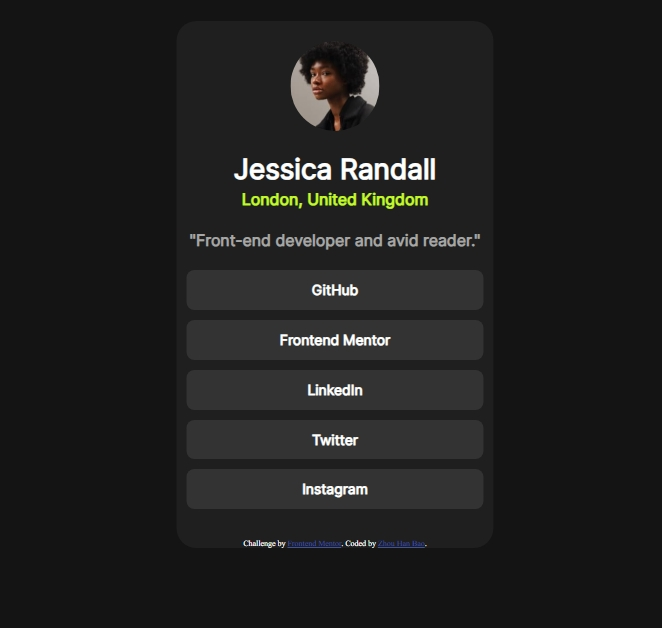

# Frontend Mentor - Social links profile solution

This is a solution to the [Social links profile challenge on Frontend Mentor](https://www.frontendmentor.io/challenges/social-links-profile-UG32l9m6dQ). Frontend Mentor challenges help you improve your coding skills by building realistic projects. 

### Screenshot

### Links

- Solution URL: [https://github.com/handipo2022/social-links-profile-main](https://github.com/handipo2022/social-links-profile-main)
- Live Site URL: [https://handipo2022.github.io/social-links-profile-main/](https://handipo2022.github.io/social-links-profile-main/)

### Built with

- Semantic HTML5 markup
- CSS custom properties
- Flexbox
- CSS Grid
- Mobile-first workflow

## Author

- Frontend Mentor - [@handipo2022](https://www.frontendmentor.io/profile/handipo2022)
